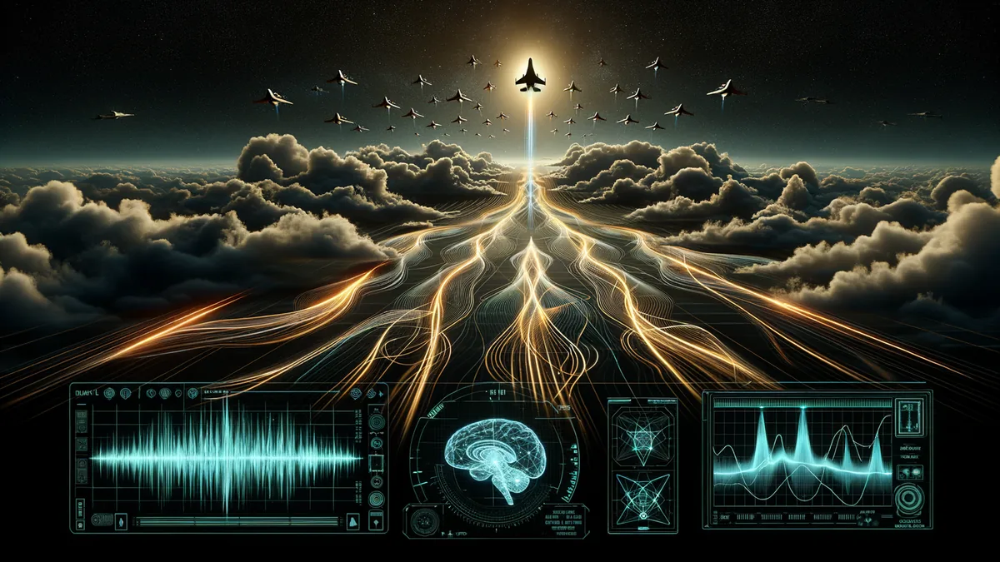
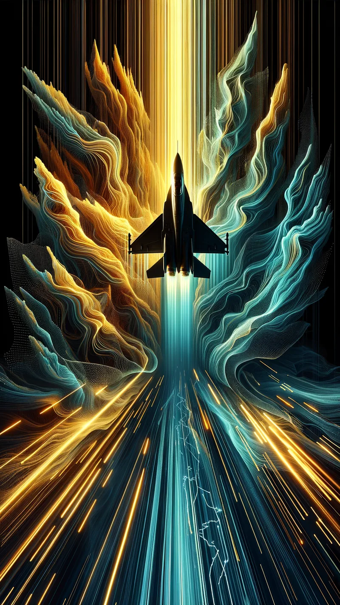

# NeuroFlight

[](https://github.com/wkyleg/neuroflight/actions/workflows/deploy.yml)
[](LICENSE)
[](tsconfig.json)

**[Play Now](https://wkyleg.github.io/neuroflight/)** | [Elata Biosciences](https://elata.bio) | [Elata SDK Docs](https://docs.elata.bio/sdk/overview)

A camera-first biofeedback flight game built with Three.js and React. Fly bounded arcade sessions, use optional webcam rPPG for local pulse-trend insight, and review a behavior-first report after each run. NeuroFlight is a wellness game, not a medical device or diagnostic tool.

## Gameplay preview

| Desktop | Mobile |
| --- | --- |
|  |  |

More sizes and store metadata: [`docs/store-assets/`](docs/store-assets/).

## Features

- **Focus Flight, Expedition, and Dogfight** -- three scored modes with warmup, three waves, recovery breaks, and final recovery
- **Unscored Tutorial** -- practice controls freely without saving a report
- **Optional webcam rPPG** -- local camera-estimated pulse trends and signal-quality coverage, no account or history
- **Behavior-first reports** -- Focus, Control, Pressure, Recovery, and Signal Quality cards; bad or missing camera signal never lowers Session Score
- **Procedural environments** -- dynamically generated terrain and sky conditions across desert, ocean, and cloud biomes
- **Browser native** -- runs entirely in the browser with Three.js rendering, bloom post-processing, and Web Audio spatial sound

## How It Works

1. **Readiness** -- Start camera biofeedback or continue behavior-only.
2. **Fly** -- Warm up, complete three waves, and use recovery breaks to settle your flight line.
3. **Review** -- Session Score is calculated from flight behavior only; camera coverage only affects insight confidence.

## Controls

| Key | Action |
|-----|--------|
| W / Arrow Up | Pitch up |
| S / Arrow Down | Pitch down |
| A / Arrow Left | Roll left |
| D / Arrow Right | Roll right |
| Q / E | Yaw left / right |
| Shift | Throttle up |
| Ctrl | Throttle down |
| B | Brake |
| **Space / Enter / Click** | **Fire** |
| R | Restart |

On-screen buttons are also available for throttle, brake, and firing.

## Tech Stack

- **Three.js** -- 3D rendering with Sky addon, bloom post-processing
- **React 19** + **TypeScript** (strict mode) -- component-based UI
- **React Router** + **Zustand** -- navigation and state management
- **Tailwind CSS 4** -- utility-first responsive styling
- **Recharts** -- data visualization for post-flight analysis
- **Web Audio API** -- spatial audio for engine sounds and weapon effects
- **Vite 8** + **TypeScript 5.9** -- fast build tooling
- **Biome** -- formatting and linting
- **Vitest** + **Testing Library** -- unit tests
- **Elata SDK** -- `@elata-biosciences/eeg-web`, `eeg-web-ble`, `rppg-web`

## Quick Start

```bash
pnpm install
pnpm dev          # dev server on http://localhost:3010
pnpm build        # tsc + vite build -> dist/
pnpm preview      # serve production build
pnpm test         # vitest (watch mode)
pnpm typecheck    # tsc --noEmit
pnpm lint         # biome check (read-only)
pnpm format       # biome format --write
```

## Debug Logs

In the browser console, `window.__ELATA_LOGGER__` exposes:

- `getLogs()` -- read the in-memory log buffer
- `download()` -- save `neuroflight-debug-<timestamp>.json`
- `setLevel("DEBUG" | "INFO" | "WARN" | "ERROR")`

Useful lifecycle tags include `GameScreen`, `Game`, `Renderer`, `Input`, `Audio`, `AudioManager`,
`Assets`, `Session`, `rPPG`, `Neuro`, and `React`. For playtest triage, reproduce the issue, then run:

```js
window.__ELATA_LOGGER__.getLogs()
window.__ELATA_LOGGER__.download()
```

The log buffer is intentionally verbose in production so lifecycle problems such as WebGL context loss,
input focus, asset loading, audio mute state, readiness, and phase transitions can be diagnosed from a
player console.

## Deployment

Pushes to `main` trigger the CI/CD pipeline which runs lint, typecheck, and tests, then deploys to GitHub Pages.

## App store listing assets

Marketing copy and image exports for store listings (icon, banner, desktop/mobile previews, expansion art) live in [`docs/store-assets/`](docs/store-assets/). Start with `listing.json`. The PNG icon is also at [`public/favicon.png`](public/favicon.png) alongside the SVG favicon.

## Related Projects

NeuroFlight is part of the [Elata Biosciences](https://elata.bio) neurotech app ecosystem. Other apps in the series:

- **[Monkey Mind: Inner Invaders](https://github.com/wkyleg/monkey-mind)** -- Brain-reactive arcade game with 140+ levels and EEG-driven gameplay
- **[Neuro Chess](https://github.com/wkyleg/neuro-chess)** -- Chess vs Stockfish with real-time neural composure tracking
- **[Reaction Trainer](https://github.com/wkyleg/reaction-trainer)** -- Stress-modulated reaction speed game with biometric difficulty scaling
- **[Breathwork Trainer](https://github.com/wkyleg/breathwork-trainer)** -- Guided breathing with live EEG and heart rate biofeedback

All apps use the [Elata Bio SDK](https://github.com/Elata-Biosciences/elata-bio-sdk) for EEG and rPPG integration.

## License

[ISC](LICENSE) -- Copyright (c) 2024-2026 Elata Biosciences
